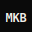

<div align="center">
  

  <h1>Mebuge Kamsiyochukwu Brendan</h1>
  <p><strong>Software Engineer building across web, mobile, and everything in between. <br />From database schema to pixel-perfect UI — end-to-end.</strong></p>
  
  <a href="https://brendanmebson.vercel.app">www.brendanmebson.vercel.app</a>

  <br /><br />
  <p>
    <b>3+ Years</b> Experience &nbsp;&middot;&nbsp; <b>20+</b> Projects &nbsp;&middot;&nbsp; <b>3</b> Platforms
  </p>
</div>

---

## 🧑‍💻 About Me

> **Building things that last.**

I’m a Software Engineer working remotely at the intersection of engineering and design. I build full-stack systems — from scalable backend architecture to refined user interfaces. Backed by a degree in Software Engineering, I’ve delivered solutions that solve real-world problems. 

I prioritize performance, scalability, and clarity — building systems that are not only functional but built to last. With a strong focus on detail and user experience, I bridge the gap between engineering and design to create products that feel as good as they perform. I turn complex ideas into clean, efficient, and production-ready solutions.

### Services & Expertise

- **01 Frontend** — React, TypeScript, and modern CSS. Pixel-perfect at every breakpoint.
- **02 Backend** — Scalable REST APIs with Node.js, Express, and cloud databases.
- **03 Mobile** — Cross-platform apps with React Native and native Kotlin.
- **04 Full-Stack** — End-to-end ownership: schema design to deployment.

### Experience & Education

- **BSc Software Engineering** — Babcock University (2021 – 2025)
  *GDSC, Coding Club, React Developers Club.*
- **Frontend Developer Intern** — IT Horizons (Zojatech) (2023)
  *Built production web apps with React and Tailwind CSS.*
- **Freelance React Developer** — Independent (Ongoing)
  *Custom web and mobile solutions for diverse clients worldwide.*

---

## 🏆 Featured Projects

A curated selection from my **20+ completed projects**, spanning mobile apps, full-stack platforms, and data-driven interfaces.

### 1. 🚨 Campus Safety App
*Emergency reporting with live location sharing and security response.*
- **Tech**: React Native, React, Supabase, Tailwind CSS
- **Detail**: Students report emergencies, share live location, and reach campus security instantly via a mobile app paired with a React admin dashboard.

### 2. 📅 Weekly Report Aggregator
*Role-based attendance tracking and automated PDF report generation.*
- **Tech**: MongoDB, Express.js, React, Node.js
- **Detail**: Full-stack MERN app with role-based access, smart attendance tracking, and automated weekly PDF generation.

### 3. 💬 Real-Time Messaging App
*WebSocket-powered chat with a sleek, modern UI.*
- **Tech**: React, TypeScript, WebSockets
- **Detail**: Real-time chat with a polished UI supporting rooms, threads, and online presence.

### 4. 🛒 E-Commerce Storefront
*Full-featured online store with cart, checkout, and order management.*
- **Tech**: React, Node.js, MongoDB, Paystack
- **Detail**: Includes product filtering, cart management, Paystack payment integration, and an admin order dashboard.

### 5. 🤖 AI Study Assistant
*GPT-powered tool that summarizes notes and generates quiz questions.*
- **Tech**: React, OpenAI API, Node.js, TypeScript
- **Detail**: Students paste lecture notes and get AI-generated summaries, flashcards, and multiple-choice quizzes.

---

## 🛠️ Tools & Technologies

**30+ Technologies | 4+ Years Experience | 3 Platforms | 100% Passion**

- **Frontend:** React, TypeScript, JavaScript, Next.js, Vue.js, Angular, Tailwind CSS, MUI, HTML5, CSS3
- **Backend:** Node.js, Express.js, MongoDB, PostgreSQL, Supabase, Firebase, PHP, SQL
- **Mobile:** React Native, Kotlin, Mobile Design
- **Languages:** Python, Java, C/C++, TypeScript, JavaScript, PHP
- **Tools:** GitHub, Git, VS Code, Figma, Docker, Vercel, AWS, Notion, Slack, Canva, WordPress, Postman

---

## 📬 Contact: Let's Talk

> **Got a project in mind?**

- 📧 **Email**: [brendanmebson@gmail.com](mailto:brendanmebson@gmail.com)
- 📍 **Location**: Remote
- 🟢 **Status**: Open to freelance & full-time
- 🔗 **LinkedIn**: [Kamsiyochukwu Mebuge](https://www.linkedin.com/in/kamsiyochukwu-mebuge-30a484258)
- 🐙 **GitHub**: [@Brendanmebson](https://github.com/Brendanmebson)

Feel free to reach out to discuss an exciting new idea, offer feedback, or talk about collaborations!

---

## 📄 Tailored Resumes

You can download my discipline-specific resumes directly from this repository:
- [Frontend Developer Resume](./Mebuge%20Kamsiyochukwu%20Brendan%20Resume-frontend.pdf)
- [Backend Developer Resume](./Mebuge%20Kamsiyochukwu%20Brendan%20Resume-backend.pdf)
- [Full-Stack Developer Resume](./Mebuge%20Kamsiyochukwu%20Brendan%20Resume-fullstack.pdf)
- [Mobile Developer Resume](./Mebuge%20Kamsiyochukwu%20Brendan%20Resume-mobile.pdf)

---

## 🚀 Running the Portfolio Locally

This portfolio website is a React application powered by Vite. To run it locally:

1. **Install dependencies**:
   ```bash
   npm install
   ```
2. **Start the development server**:
   ```bash
   npm run dev
   ```

---

<div align="center">
  <p>Created by <a href="https://github.com/Brendanmebson">@Brendanmebson</a></p>
</div>
